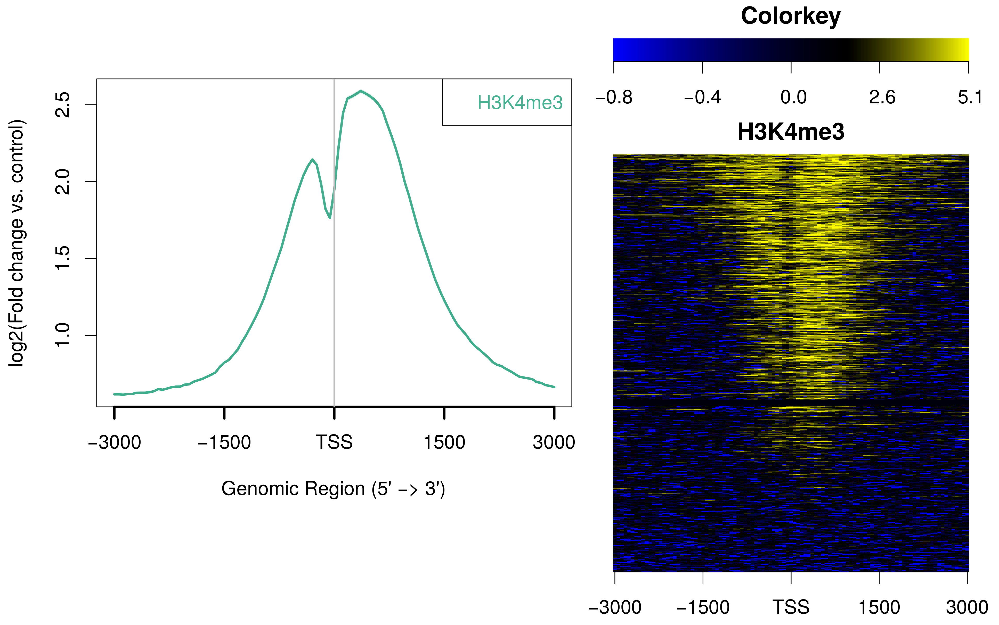
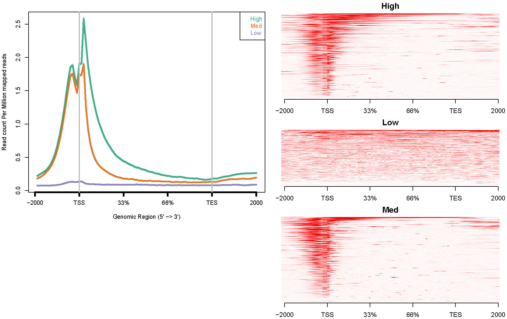
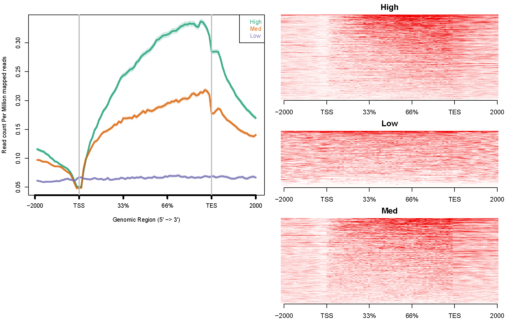
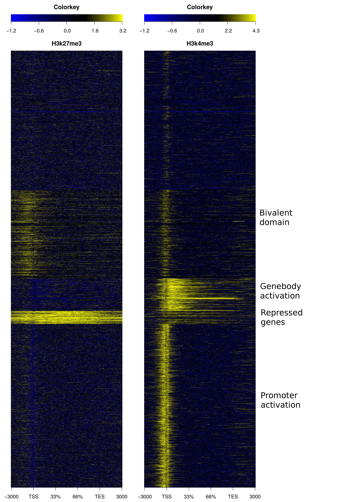
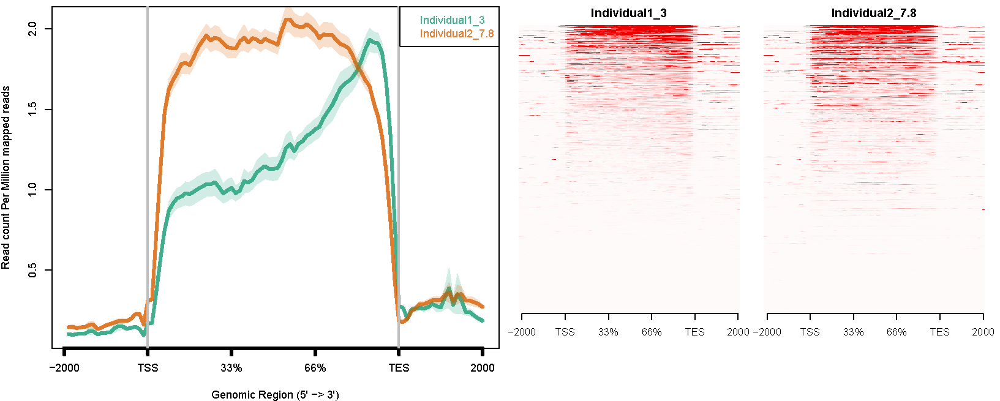

Shield: [![CC BY-NC-SA 4.0][cc-by-nc-sa-shield]][cc-by-nc-sa]

This work is licensed under a
[Creative Commons Attribution-NonCommercial-ShareAlike 4.0 International License][cc-by-nc-sa].

[![CC BY-NC-SA 4.0][cc-by-nc-sa-image]][cc-by-nc-sa]

[cc-by-nc-sa]: http://creativecommons.org/licenses/by-nc-sa/4.0/
[cc-by-nc-sa-image]: https://licensebuttons.net/l/by-nc-sa/4.0/88x31.png
[cc-by-nc-sa-shield]: https://img.shields.io/badge/License-CC%20BY--NC--SA%204.0-lightgrey.svg

# Development note:
## ngs.plot has been updated to work with Python 3, as well as the current versions of R and Perl. It has successfully been tested on a Linux system. Further testing on additional operating systems (e.g. MAC) may be needed. Please submit an issue for errors that you may encounter, so that we can improve this tool!

# INTRODUCTION
**To be brief: ngs.plot is a program that allows you to easily visualize your next-generation sequencing (NGS) samples at functional genomic regions.**

DNA sequencing is at the core of genomics. The NGS technology has been tremendously improved in the past few years. It can now determine more than a billion DNA sequences within a week, generating terabytes of data. Applications include but are not limited to: 1. ChIP-seq which profiles genome-wide protein-DNA interactions; 2. RNA-seq which measures the gene expression levels. It is very helpful to look at the enrichment of those sequences at various functional regions. Although a genome browser (such as the UCSC genome browser) allows a researcher to visualize these data, it limits the view to a slice of the genome, while the genome is like a huge collection of functional elements that can be classified into different categories; each category of elements may perform distinct functions and they might contain sub-modules.

The signature advantage of ngs.plot is that it collects a large database of functional elements for many genomes. A user can ask for a functionally important region to be displayed in one command. It handles large sequencing data efficiently and has only modest memory requirement. For example, ngs.plot was used to draw a plot for all the genes on the mouse genome from **71GB of ChIP-seq data in 25 min**, with a **memory footprint of 2.7GB using 4 x 2.4GHz CPU cores**. ngs.plot is also easy to use. A user only needs to create a very small text file called configuration, telling the program which samples to look at and how they should be combined with different regions, and then run the program with one command. A web-based version (integrated into Galaxy) is also available for the ones who are "allergic" to terminals.

## Program Download Location
For ready-to-install packages and example bam files, go to the [ngs.plot download GDrive](https://drive.google.com/folderview?id=0B1PVLadG_dCKN1liNFY0MVM1Ulk&usp=sharing).

## Galaxy Tool Shed
ngs.plot is now available on the [Galaxy tool shed](https://toolshed.g2.bx.psu.edu/view/ngsplot/ngsplot). You can also easily find it by searching "ngsplot" for repositories. The Galaxy tool shed allows you to install ngs.plot to your local Galaxy instance with a few clicks. Of course, you can always install it manually using the files provided under the "galaxy" folder.

## Supported Genomes & How to Build Your Own Genome Files
ngs.plot has an approach to install genomes on demand. It can support for any genome. All you need to do is to download an archive file and install it by yourself. The genome files can be found in this Google drive folder: [ngs.plot genome folder](https://drive.google.com/folderview?id=0B1PVLadG_dCKNEsybkh5TE9XZ1E&usp=sharing).
A list of the available genomes is listed in this Wiki: [SupportedGenomes](https://github.com/shenlab-sinai/ngsplot/wiki/SupportedGenomes). A brief list is here (not all): "human (hg18, hg19), chimpanzee (panTro4), rhesus macaque (rheMac2), mouse (mm9, mm10), rat (rn4, rn5), cow (bosTau6), chicken (galGal4), zebrafish (Zv9), drosophila (dm3), Caenorhabditis elegans (ce6, ceX), Saccharomyces cerevisiae (sacCer2, sacCer3), Schizosaccharomyces pombe (Asm294), Arabidopsis thaliana (TAIR10), Zea mays (AGPv3), rice (IRGSP-1.0)".

We have open-sourced the pipeline - [ngsplotdb](https://github.com/shenlab-sinai/ngsplotdb) for building genome files. You can now use this pipeline to create your own genome files. We will no longer accept requests for custom genome files. Please make contributions to this pipeline if you want to. That will benefit a great number of people.

## Extension Annotation Package: Enhancers and DHSs
There are now two database files for the reference genome hg19 and mm9. The basic package is a light version of the genome, which only contains the regular stuffs like genebody, CGI and exon. While extension package is an extension of the genome, which contains enhancers or dhs.

By default, the main program installation comes with basic package only. However, if you want to plot enhancers and dhs for the two genomes, you can download the package files from the shared Google drive folder and install them using `ngsplotdb.py`.

## A note about the compatibility between genome files and program versions
The 3.0+ genome files work with ngs.plot v2.41+; The 1-2 series of genome files work with ngs.plot v2.08 and below.

# DISCUSSION FORUM
Recent changes, bug fixes and feature additions will be announced through this Google discussion group: [ngs.plot discussion forum](https://groups.google.com/forum/?fromgroups#!forum/ngsplot-discuss). Users are encouraged to ask questions through this forum (instead of shooting me emails) so that the answers can be shared. If you are interested, you can sign up to receive updates through E-mails.

# LOCAL INSTALLATION
ngs.plot has been updated to work with Python 3, as well as the current versions of R and Perl. The update has been successfully tested on R version 4.2.2, Python version 3.11.0, and Perl version 5.36.0. The reference genome files for mm10 and hg38 have been successfully tested for use in this update.

1. Download the ngs.plot package to a desired folder, such as ~/software, and extract it:
   ```
   cd ~/software
   tar xzvf ngsplot-XXX.tar.gz
   ```
   The program will be extracted into a folder called "ngsplot".

1. Add ngsplot executables to your PATH. Under bash, add line like this:
   ```
   export PATH=~/software/ngsplot/bin:$PATH
   ```
   to your ~/.bash_profile

1. Set environment variable NGSPLOT like this in your ~/.bash_profile:
   ```
   export NGSPLOT=~/software/ngsplot
   ```
   Then in the terminal, execute:
   ```
   source ~/.bash_profile
   ```
   A trick to avoid setting environment variable is:
   ```
   NGSPLOT=/your/path/to/ngsplot bash -c 'ngs.plot.r XXX'
   ```

1. Install some required libraries in R:
   ```R
   install.packages("doMC", dep=T)
   install.packages("caTools", dep=T)
   install.packages("utils", dep=T)
   source("http://bioconductor.org/biocLite.R")
   biocLite( "BSgenome" )
   biocLite( "Rsamtools" )
   biocLite( "ShortRead" )
   ```

1. (Optional) Install ngsplot package in Galaxy: read the `galaxy/README.txt` for instructions. A wiki will be provided to demonstrate the workflow of ngs.plot in Galaxy.

# USAGE
A wiki-page has been created for detailed explanation of each argument: [ProgramArguments101](https://github.com/shenlab-sinai/ngsplot/wiki/ProgramArguments101). Quick tip: when you type one of the commands without specifying any argument, the program will print out a brief usage. 

## Manipulate annotation database and the use of option "-F"
The `ngsplotdb.py` script is easy to use. Here are a few examples:
```
ngsplotdb.py list  # List installed genomes.
ngsplotdb.py install ngsplotdb_hg19_71_2.0.tar.gz  # Install reference genome from a package file.
ngsplotdb.py remove hg19  # Remove installed genome.
ngsplotdb.py remove --ftr enhancer hg19  # Remove enhancer installation from hg19.
```
The "-F" option is a string of descriptors to refine the annotation to use. See this Wiki page for detailed explanation: [UseFurtherInfo](https://github.com/shenlab-sinai/ngsplot/wiki/UseFurtherInfo). Here are a few examples:
```
-F K562  # Select cell line.
-F K562,lincRNA  # Select cell line and gene type.
-F lincRNA,K562  # Same as above(order does not matter).
-F Promoter3k,H1hesc,protein_coding  # Select region, cell line and gene type(apply to DHS only).
```

## ngs.plot.r
Use ngs.plot.r to choose a genomic region of interest and create enrichment plots for any ChIP-seq or RNA-seq samples. Type `ngs.plot.r 2>&1|less` at terminal will give you a brief usage summary for online reference. Here is just a truncated output:
```
Usage: ngs.plot.r -G genome -R region -C [cov|config]file
                  -O name [Options]
## Mandatory parameters:
  -G   Genome name. Use ngsplotdb.py list to show available genomes.
  -R   Genomic regions to plot: tss, tes, genebody, exon, cgi, enhancer, dhs or bed
  -C   Indexed bam file or a configuration file for multiplot
  -O   Name for output: multiple files will be generated
```

## replot.r
Use replot.r to re-create plots with already generated data using different parameters. There are a couple of options for you to finetune the figures.
```
Usage: replot.r command -I input.zip -O name
  command: prof OR heatmap
## Mandatory parameters:
    -I  Result zip file created by ngs.plot
    -O  Output name
```

## plotCorrGram.r
Create a corrgram from ngs.plot output files.
```
Usage: plotCorrGram.r -I ngsplot_output.zip -O output_name [Options]
## Mandatory parameters:
  -I   Result zip file created by ngs.plot.
  -O   Output name
## Optional parameters:
  -M   Method used to calculate row stat.
       mean(default): mean of each row.
       max: max of each row.
       window: mean on center region.
  -P   Options for -M method.
       mean: [0,0.5) - trim value for robust estimation, default is 0.
       window: [0,0.5),(0.5,1] - window borders, default:0.33,0.66.
  -D   Options for distance calculation in hierarchical cluster.
       This must be one of 'euclidean'(default), 'maximum', 'manhattan', 'canberra', 'binary' or 'minkowski'.
  -H   Options for agglomeration method in hierarchical cluster.
       This must be one of 'ward'(default), 'single', 'complete', 'average', 'mcquitty', 'median' or 'centroid'.
```

# EXAMPLES
1. ngs.plot.r needs an indexed bam file or a configuration file as an input to plot short read coverage across the genomic regions of interest. ngs.plot.r will generate multiple files including average profile, heatmap and a zip file for replotting.
   Issue a command like this:
   ```
   ngs.plot.r -G hg19 -R tss -C hesc.H3k4me3.rmdup.sort.bam -O hesc.H3k4me3.tss -T H3K4me3 -L 3000 -FL 300
   ```
   Data from: **Ernst, J., Kheradpour, P., Mikkelsen, T.S., Shoresh, N., Ward, L.D., Epstein, C.B., Zhang, X., Wang, L., Issner, R., Coyne, M., et al. (2011). Mapping and analysis of chromatin state dynamics in nine human cell types. Nature 473, 43-49.**

   Will produce an avgprof and a heatmap like this:

   

   ngs.plot can also accept bam-pairs for plotting. A bam-pair is a pair of bam files separated by colon, such as ChIP vs. Input. Using H3K4me3 as an example, you can issue a command like this:
   ```
   ngs.plot.r -G hg19 -R tss -C hesc.H3k4me3.rmdup.sort.bam:hesc.Input.rmdup.sort.bam -O hesc.H3k4me3vsInp.tss -T H3K4me3 -L 3000
   ```
   The avgprof and heatmap plotted by ngs.plot are like this:

   

   Regarding the color selection for your heatmap: Both bam-pairs and single-bam selections can be drawn with customized R color selections using the "CO" parameter:
   ```
   ## Produce a bam-pair heatmap with colors yellow -> white -> royalblue
   ngs.plot.r -G mm10 -R tss -C sample_A.bam:sample_B.bam -O output/A.vs.B 
   -T A.vs.B -CO yellow:white:royalblue
   ## Produce a bam-pair heatmap with colors yellow -> black -> royalblue
   ngs.plot.r -G mm10 -R tss -C sample_A.bam:sample_B.bam -O output/A.vs.B 
   -T A.vs.B -CO yellow:royalblue
   ## Produce a single-bam heatmap with colors white -> royalblue
   ngs.plot.r -G mm10 -R tss -C sample_A.bam:sample_B.bam -O output/A.vs.B 
   -T A.vs.B -CO royalblue
   ## Produce a single-bam heatmap with colors yellow -> royalblue
   ngs.plot.r -G mm10 -R tss -C sample_A.bam:sample_B.bam -O output/A.vs.B 
   -T A.vs.B -CO yellow:royalblue
   ```

1. ngs.plot for multiplot. If you want to draw a plot of multiple samples/regions, you need to create a configuration file. We demonstrate multiplot using a few examples:
  1. H3K4me3. The configure file "config.hesc.k4.txt" is like this:
      ```
      # If you want to specify the gene list as "genome", use "-1".
      # Use TAB to separate the three columns: coverage file<TAB>gene list<TAB>title
      # "title" will be shown in the figure's legend.
      hesc.H3k4me3.rmdup.sort.bam     high_expressed_genes.txt         "High"
      hesc.H3k4me3.rmdup.sort.bam     medium_expressed_genes.txt       "Med"
      hesc.H3k4me3.rmdup.sort.bam     low_expressed_genes.txt          "Low"
      ```
      Command like this:
      ```
      ngs.plot.r -G hg19 -R genebody -C config.hesc.k4.txt -O hesc.k4.genebody -D ensembl -FL 300
      ```
      The avgprof and heatmap plotted by ngs.plot like this:

      

  1. H3K36me3. The configure file "config.hesc.k36.txt" is like this:
      ```
      hesc.H3k36me3.rmdup.sort.bam     high_expressed_genes.txt         "High"
      hesc.H3k36me3.rmdup.sort.bam     medium_expressed_genes.txt       "Med"
      hesc.H3k36me3.rmdup.sort.bam     low_expressed_genes.txt          "Low"
      ```
      Command like this:
      ```
      ngs.plot.r -G hg19 -R genebody -C config.hesc.k36.txt -O hesc.k36.genebody -D ensembl -FL 300
      ```
      The avgprof and heatmap plotted by ngs.plot like this:

      

  1. H3K27me3. The configure file "config.hesc.k27.txt" is like this:
      ```
      hesc.H3k27me3.rmdup.sort.bam     high_expressed_genes.txt         "High"
      hesc.H3k27me3.rmdup.sort.bam     medium_expressed_genes.txt       "Med"
      hesc.H3k27me3.rmdup.sort.bam     low_expressed_genes.txt          "Low"
      ```
      Command like this:
      ```
      ngs.plot.r -G hg19 -R genebody -C config.hesc.k27.txt -O hesc.k27.genebody -D ensembl -FL 300
      ```
      The avgprof and heatmap plotted by ngs.plot like this:

       

   For all the above examples, data are from: **ENCODE Project Consortium, et al. (2012). An integrated encyclopedia of DNA elements in the human genome. Nature 489, 57-74.**

1. ngs.plot contains several algorithms for ranking genes/regions, including two clustering methods - hierarchical clustering and k-means. To avoid the result being dominated by the sample with the largest read coverage, the values are converted to ranks for clustering. Here we provide an example using two histone marks - H3K27me3 and H3K4me3 and K-means clustering:

   The configuration file "config.k4k27.inp.txt" looks like this:
   ```
   hesc.H3k27me3.sort.bam:hesc.Input.sort.bam    -1      "H3k27me3"
   hesc.H3k4me3.sort.bam:hesc.Input.sort.bam     -1      "H3k4me3"
   ```
   Use command:
   ```
   ngs.plot.r -G hg19 -R genebody -L 3000 -C config.k4k27.inp.txt -O k4k27_km_gb -GO km
   ```
   The heatmap looks like this (cluster labels are manually added):

   

1. ngs.plot can be used to analyze RNA-seq data. Here We used an in-house RNA-seq dataset (unpublished) from human post-mortem brain tissue of schizophrenia patients as an example. One sample with acceptable RNA quality (RIN=7.8) and another sample with degraded RNA quality (RIN=3) are chosen.
   ```
   Individual1_3.bam     -1       "Individual1_3"
   Individual2_7.8.bam   -1       "Individual2_7.8"
   ```
   Command like this:
   ```
   ngs.plot.r -G hg19 -R genebody -C config.RIN_number.txt -O RIN_number -F rnaseq
   ```
   The avgprof and heatmap plotted by ngs.plot like this:

   

   The plot above shows that the sample with lower RIN number is significantly biased in short read coverage towards the 3’ end.

# TERMS OF USE
All data is free to use for non-commercial purposes. For commercial use please contact [MSIP](https://www.ip.mountsinai.org/).

# HOW TO CITE
**Shen, L.*, Shao, N., Liu, X. and Nestler, E. (2014) ngs.plot: Quick mining and visualization of next-generation sequencing data by integrating genomic databases, BMC Genomics, 15, 284.**

Here is a [list of publications](https://scholar.google.com/scholar?start=0&hl=en&as_sdt=5,31&cites=72561154389931100&scipsc=) that cite ngs.plot, found by Google Scholar.

# CONTACT
ngs.plot is developed by Drs. Li Shen, Ningyi Shao, Xiaochuan Liu and Eddie Loh at the Icahn School of Medicine at Mount Sinai. If you have technical questions about ngs.plot, please use the [ngs.plot discussion forum](https://groups.google.com/forum/#!forum/ngsplot-discuss). For collaborations or any other matters, contact: li.shen**AT**mssm.edu.
